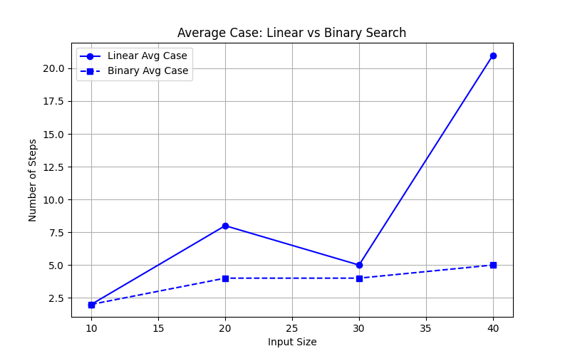
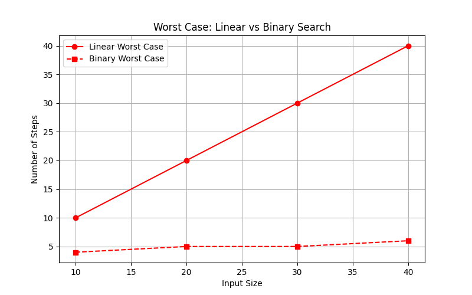

# Searching Algorithms

## Linear Search
## Binary Search

# Code
```cpp
#include <iostream>
#include <vector>
#include <ctime>
using namespace std;

int linearSearch(vector<int>& arr,int value){
    int stepCount=0;
    for(int i=0;i<arr.size();i++){
        stepCount++; 
        if (arr[i]==value){return stepCount;}
    }
    return stepCount;
}

int binarySearch(vector<int>& arr,int value){
    int stepCount=0;
    int left=0;
    int right=arr.size()-1;
    while (left<=right){
        stepCount++; 
        int mid=(left+right)/2;
        if(arr[mid]==value){return stepCount;}
        else if(arr[mid]<value){left=mid+1;}
        else{right=mid-1;}
    }
    return stepCount;
}

void analyzesearchingalgorithms() {
    vector<int> inputSizes={10,20,30,40};
    for(int i=0;i<inputSizes.size();i++){
        int size=inputSizes[i];
        vector<int> arr(size);
        for(int i=0;i<size;i++){
            arr[i]=i+1; 
        }
        int bestcase=arr[0];          
        int worstcase=arr[size-1];
        int randomindex=rand()%size;
        // cout<<"Random Index: "<<randomindex<<endl;
        int randomcase=arr[randomindex]; 
        cout<<"=================== Input Size: "<<size<<" ==================="<<endl<<endl;
        cout<<"Linear Search---------"<<endl;
        cout<<"Best Case= "<<linearSearch(arr,bestcase)<<"steps"<<endl;
        cout<<"Average Case= "<<linearSearch(arr,randomcase)<<"steps\n";
        cout<<"Worst Case= "<<linearSearch(arr,worstcase)<<"steps\n";
        cout<<"Binary Search----------"<<endl;
        cout<<"Best Case= "<<binarySearch(arr,arr[size/2])<<"steps"<<endl;
        cout<<"Average Case= "<<binarySearch(arr,randomcase)<<"steps"<<endl;
        cout<<"Worst Case= "<<binarySearch(arr,worstcase)<<"steps"<<endl; 
        cout<<"==================================================================="<<endl<<endl;
    }
}

int main(){
    cout<<endl;
    analyzesearchingalgorithms();
}
```
# Output:
```cpp

=================== Input Size: 10 ===================

Linear Search---------
Best Case= 1steps
Average Case= 2steps
Worst Case= 10steps
Binary Search----------
Best Case= 3steps
Average Case= 2steps
Worst Case= 4steps
===================================================================

=================== Input Size: 20 ===================

Linear Search---------
Best Case= 1steps
Average Case= 8steps
Worst Case= 20steps
Binary Search----------
Best Case= 4steps
Average Case= 4steps
Worst Case= 5steps
===================================================================

=================== Input Size: 30 ===================

Linear Search---------
Best Case= 1steps
Average Case= 5steps
Worst Case= 30steps
Binary Search----------
Best Case= 5steps
Average Case= 4steps
Worst Case= 5steps
===================================================================

=================== Input Size: 40 ===================

Linear Search---------
Best Case= 1steps
Average Case= 21steps
Worst Case= 40steps
Binary Search----------
Best Case= 5steps
Average Case= 5steps
Worst Case= 6steps
===================================================================
```
# Graphs
## Best Case


## Average Case


## Worst Case

